  

## Hi, I'm Carl

Computer Engineering student at the Polytechnic University of the Philippines, Manila. I work best where software has to meet a real operating context: messy users, constrained hardware, deployment limits, documentation debt, and deadlines that do not care about the architecture diagram.

Right now I am a part-time junior developer/researcher at Dewise, building around B2B SaaS documentation, DevOps surfaces, compliance research, and AI-assisted engineering workflows. Outside work, my strongest project lane is applied systems: Laravel/React apps, Arduino/KiCad builds, Cisco network designs, and technical papers that keep the evidence close to the claim.

## Current Focus

- **Dewise / workplace equity tooling:** documentation architecture, RBAC/access-control specs, EU Pay Transparency Directive research, Kubernetes/Helm/Terraform documentation, testing workflows, and AI-agent operations.
- **PrepFlow:** restaurant pre-order and kitchen-prep automation with Laravel, React, TypeScript, MySQL/TiDB, OCR-assisted payment review, procurement views, and Android packaging.
- **BahayShield ULTRA:** Arduino Mega flood/typhoon preparedness system with ultrasonic water-level sensing, barometric trend logic, staged alerts, relay safety cut-off, KiCad PCB work, and evidence-driven hardware bring-up.
- **Networking and security:** Cisco Packet Tracer labs, VLANs, OSPF, HSRP, LACP, STP, port security, DHCP snooping, WPA2-Enterprise, and CCNA-ITN foundations.

## Selected Work

| Project | What it shows | Stack / tools |
|---|---|---|
| [PUP CEA-CpE Portal](https://github.com/cikeyz/pup-cea-cpe-portal) | PHP/MySQL student and guest portal with login, registration, role-aware dashboard, password reset, and PUP-style student number generation. | PHP, MySQL, JavaScript, CSS |
| [cto.new-live](https://github.com/cikeyz/cto.new-live) | TypeScript app surface for fast app previews and task-change iteration. | TypeScript, CSS, JavaScript |
| PrepFlow | Full-stack order automation for a food micro-enterprise, including admin/customer workflows, OCR-assisted receipts, procurement logic, and Capacitor Android shell. | Laravel, React, TypeScript, MySQL/TiDB, Cloudinary, Tesseract, Capacitor |
| BahayShield ULTRA | Embedded safety system combining sensors, firmware scheduling, relay control, PCB design, enclosure/diorama planning, and formal test evidence. | Arduino C/C++, KiCad, HC-SR04, BME280, DS3231, PCF8574 |
| PUP Lab High School network design | Four-floor enterprise-style campus network with segmentation, redundancy, wireless, and edge-security design. | Cisco Packet Tracer, IOS CLI, OSPF, HSRP, LACP, Rapid PVST+ |

## Toolbelt

**Software:** TypeScript, React, PHP, Laravel, Python, C#/.NET exposure, SQL, REST APIs  
**Infra and testing:** Docker, GitHub Actions, Helm, Kubernetes, Terraform, JMeter, Gatling, PHPUnit  
**Embedded and hardware:** Arduino, KiCad, I2C sensors, relays, PCB bring-up, evidence-based test logs  
**Docs and research:** Markdown, Hugo, Diataxis, OpenAPI, Mermaid/PlantUML, EU compliance research, APA/IEEE writing  
**Networking:** Cisco IOS, VLANs, routing, switching, WLAN, Packet Tracer, Wireshark

## How I Work

I care about the handoff, not just the build. Good work should explain what was changed, how it was verified, what assumptions are still open, and where the next person should start. That bias shows up in my repos as READMEs, runbooks, diagrams, source-linked evidence folders, and test notes.

## Quick Links

[GitHub](https://github.com/cikeyz) · [Public repos](https://github.com/cikeyz?tab=repositories) · Manila, Philippines
